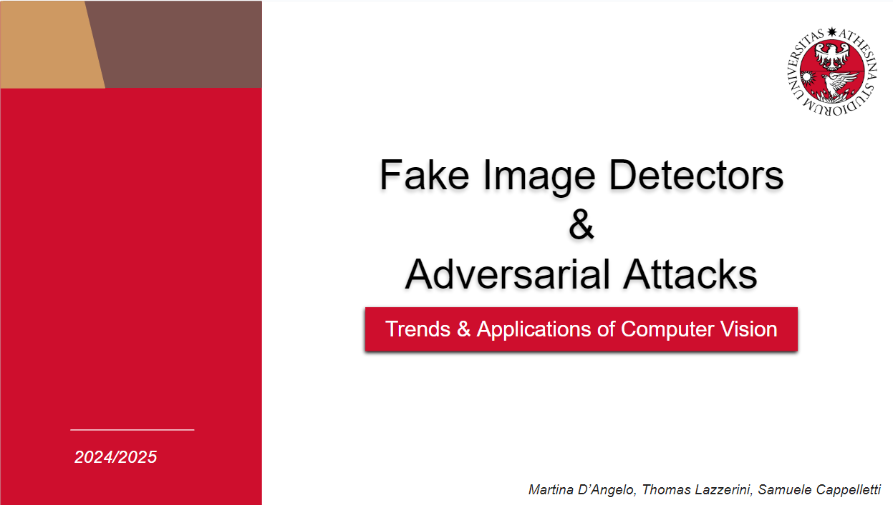
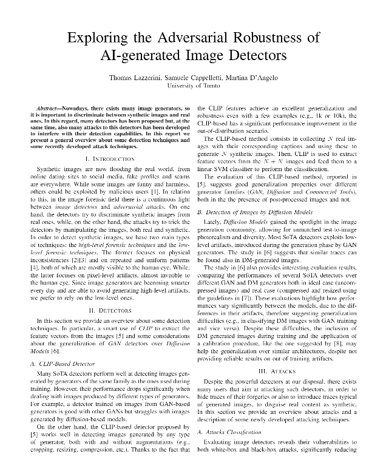
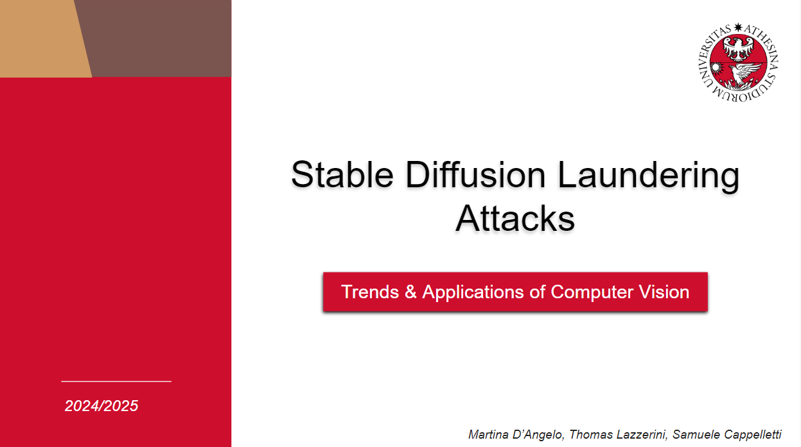

# Fake Image Detectors
The goal of this project was to explore the Adversarial Robustness of AI-generated Image Detectors.


| <a href="docs/presentations/First_presentation.pdf" target="_blank"><b>First presentation</b></a> | <a href="docs/report/main.pdf" target="_blank"><b>Report</b></a> | <a href="docs/presentations/Second_presentation.pdf" target="_blank"><b>Final presentation</b></a> |
|--------------------------------------------------------------------------------------------------------------------------|---------------------------------------------------------------------------------------------------------------------------------|--------------------------------------------------------------------------------------------------------------------------------|
| [](docs/presentations/First_presentation.pdf) | [](docs/report/main.pdf)         | [](docs/presentations/Second_presentation.pdf)        |


## First presentation
The first presentation can be found [here](docs/presentations/First_presentation.pdf)

In the first presentation we focused on an overview of SOTA **Detectors**, trying to understand the different available methods and their differences and **Adversarial Attacks** to understand the different ways to attack a model.
## Report
The report can be found here [here](docs/report/main.pdf).
This report aims to provide a general overview about some **detection** techniques and some recently developed **attack** techniques. Although not exhaustive, we exensively researched the field in order to provide a overall summary.
The papers considered for the detectors are [here](docs/papers/papers-deepfake-detection-SoA/) and the papers for adversarial attacks are [here](docs/papers/papers-multimedia-forensics-adversarial-attacks-SoA/)

## Notebooks
- The notebook used for **cropping** the images is [here](code/image_cropper.ipynb).
- The notebook used for **laundering** the images is [here](code/laundering_pipeline.ipynb)
- The notebook used for **plotting** the results is [here](code/plotter.ipynb).

To execute the two **pipelines** described in the paper, follow the model installation procedures outlined in the official [repository](https://github.com/polimi-ispl/synthetic-image-detection) of the paper[A]. After installing the required packages and models, you have to edit the script files "*test_real_vs_synthetic_singleimg_modded-2.py*" and "*test_fullysynth_vs_laundered_singleimg_modded-2.py*", in particular the "*stuff*" list. Such list contains a series of tuples structured like "(<image_folder_path>, <score_output_file>)". After this, you can place the scripts inside the folder from [A] and run the following commands:

```bash:
python test_real_vs_synthetic_singleimg_modded-2.py 
```

and 

```bash:
python test_fullysynth_vs_laundered_singleimg_modded-2.py 
```

## Second presentation
The second presentation can be found here [here](Presentation_2/LAST_presentation.pdf)
In here we discuss the results of both our research in SD-based laundering attacks in combination of different techniques.

In the end, a very brief summary is:

We aim to dive deeper into the approaches proposed in Mandelli’s paper **[A]**:
- **Verify** the capabilities of the SD-based laundering attack using the MMLAB dataset.
- **Investigate** the capabilities of the detector under different SD-based laundering attacks.
- **Evaluate** the robustness of the detector proposed in **[A]**.

<!-- TODO -->
Results:
- in presentation 2 


## Implemented papers

**[A]** Mandelli, S., Bestagini, P., & Tubaro, S. (2024). *When Synthetic Traces Hide Real Content: Analysis of Stable Diffusion Image Laundering.* arXiv preprint [arXiv:2407.10736](https://arxiv.org/abs/2407.10736).

