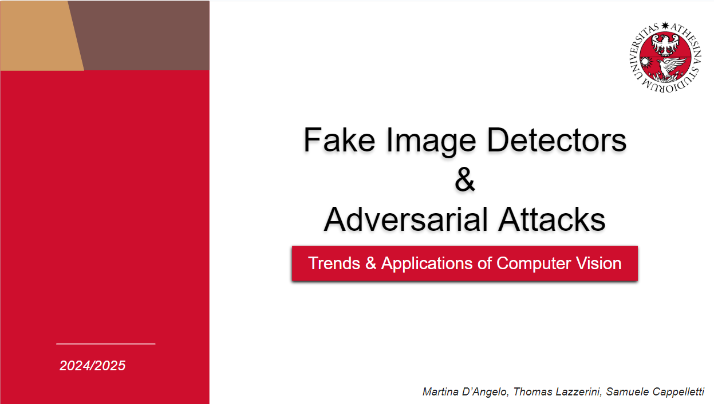
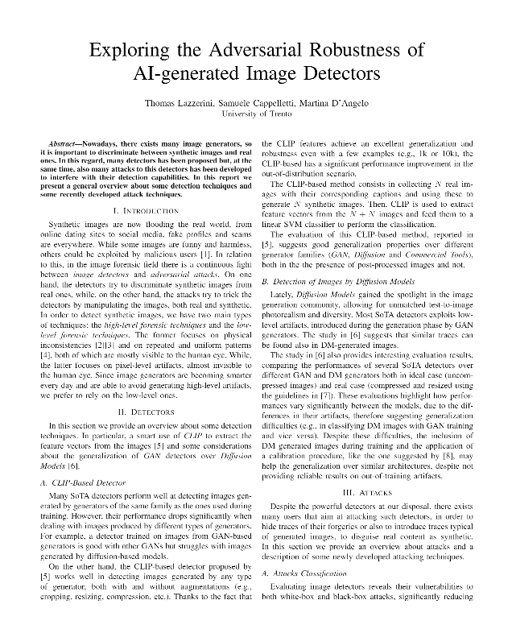
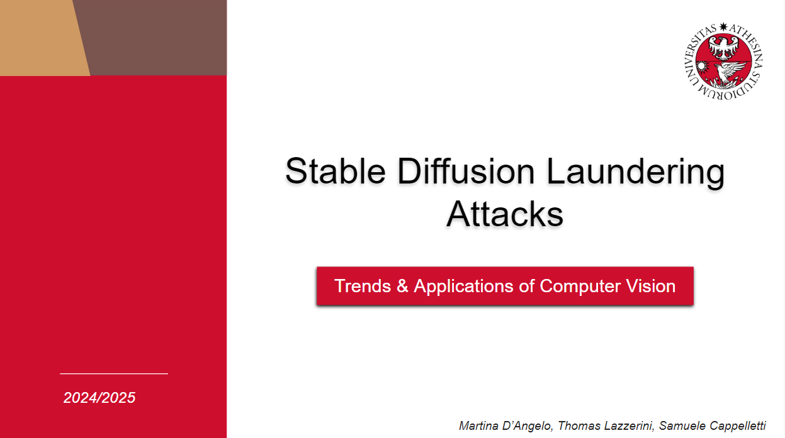

# Fake Image Detectors
The goal of this project was to explore the Adversarial Robustness of AI-generated Image Detectors.

## Outline

| <a href="Presentation_1/Img/First_presentation.pdf" target="_blank"><b>First presentation</b></a> | <a href="Report/main.pdf" target="_blank"><b>Report</b></a> | <a href="Presentation_1/Img/First_presentation.pdf" target="_blank"><b>Final presentation</b></a> |
|--------------------------------------------------------------------------------------------------------------------------|---------------------------------------------------------------------------------------------------------------------------------|--------------------------------------------------------------------------------------------------------------------------------|
|  |          |         |

## First presentation
The first presentation can be found [here](Presentation_1/Img/First_presentation.pdf)

In the first presentation we focused on an overview of SOTA **Detectors**, trying to understand the different available methods and their differences and **Adversarial Attacks** to understand the different ways to attack a model.
## Report
The report can be found here [here](Report/main.pdf).
This report aims to provide a general overview about some **detection** techniques and some recently developed **attack** techniques. Although not exhaustive, we exensively researched the field in order to provide a overall summary.

## Notebooks
The notebooks used for the test and analysis are [here](EXPERIMENTS/) and [here](SD_script/)
<!-- The main ideas are two:
- [note.ipynb](src/notebooks/note.ipynb): blablabla
 <a target="_blank" href="https://colab.research.google.com/github/filippodaniotti/TACV-DA-project/blob/master/src/notebooks/adversarial_architectures.ipynb">    -->
      |

## Second presentation
The second presentation can be found here [here](Presentation_2/LAST_presentation.pdf)
In here we discuss the results of both our research in SD-based laundering attacks in combination of different techniques.

In the end, a very brief summary is:

We aim to dive deeper into the approaches proposed in Mandelli’s paper **[A]**:
- **Verify** the capabilities of the SD-based laundering attack using the MMLAB dataset.
- **Investigate** the capabilities of the detector under different SD-based laundering attacks.
- **Evaluate** the robustness of the detector proposed in **[A]**.

Results:
- in presentation 2

## Implemented papers

**[A]** Mandelli, S., Bestagini, P., & Tubaro, S. (2024). *When Synthetic Traces Hide Real Content: Analysis of Stable Diffusion Image Laundering.* arXiv preprint [arXiv:2407.10736](https://arxiv.org/abs/2407.10736).

